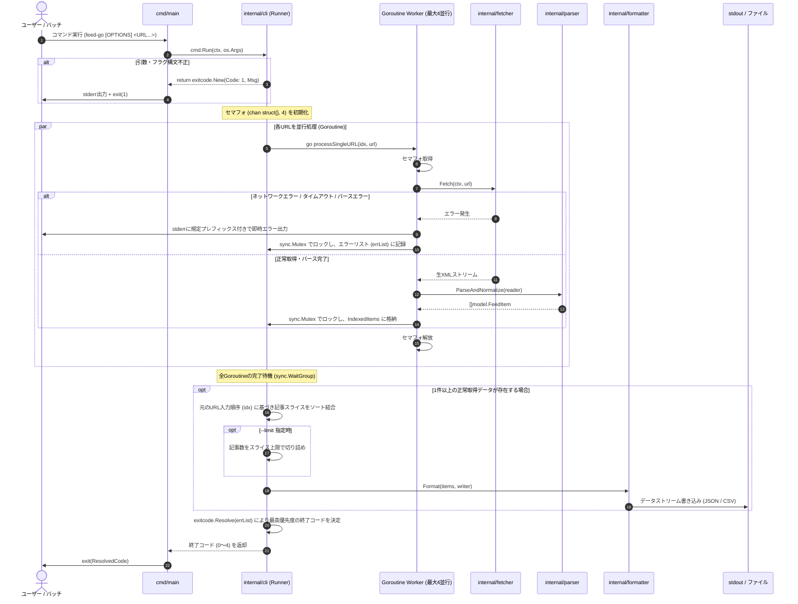

# コマンドラインフィード取得ツール（feed-go）システム設計書

## 1. システム概要・アーキテクチャ全体像
feed-go は外部ランタイムに依存しない単一バイナリ形式のCLIツールです[cite: 3]。Unix哲学（ストリーム処理・単一責務の原則）に準拠し、標準入力・引数オプションを受け取り、ネットワーク取得、XMLパース、HTMLサニタイズ、データ正規化、フォーマット出力を実行します[cite: 3]。複数URL指定時はセマフォによる最大4並行処理を行い、常駐メモリ30MB以下を維持しつつ低レイテンシを実現します[cite: 5, 9]。

### 1.1 全体アーキテクチャ図
```mermaid
flowchart TD
    subgraph ExecutionContext["実行環境 (OS / Shell / CI/CD)"]
        CLI_INPUT["コマンド引数・フラグ<br/>(URL..., -f, -o, -t, -l)"]
        STDOUT["標準出力 (stdout)<br/>正常系データ (JSON / CSV)"]
        STDERR["標準エラー出力 (stderr)<br/>エラー / 警告ログ"]
        FILE_OUT["ファイル出力 (.json / .csv)"]
    end

    subgraph feed_go["feed-go Binary (Go)"]
        CLI["CLI コントローラー<br/>(urfave/cli/v3)"]
        RUNNER["並行実行・集約制御<br/>(Runner: 4並行 Worker Pool)"]
        
        subgraph Pipeline["ワーカー処理パイプライン"]
            FETCHER["HTTP フェッチャー<br/>(net/http + context)"]
            PARSER["フィードパーサー<br/>(mmcdole/gofeed v1.3.0)"]
            SANITIZER["HTML サニタイザー<br/>(golang.org/x/net/html)"]
        end

        FORMATTER["フォーマッター<br/>(encoding/json, encoding/csv)"]
        ERR_RESOLVER["エラー優先度解決・終了コード制御<br/>(exitcode.Resolve: 0-4)"]
    end

    subgraph External["外部リソース"]
        HTTP_FEED["Webサーバー群<br/>(RSS 0.9x/1.0/2.0, Atom)"]
    end

    CLI_INPUT --> CLI
    CLI --> RUNNER
    RUNNER -->|セマフォ (上限4)| Pipeline
    Pipeline <-->|HTTP/HTTPS (Timeout: 10s)| HTTP_FEED
    FETCHER -->|Raw XML Stream| PARSER
    PARSER -->|Raw Summary/Content| SANITIZER
    SANITIZER -->|Normalized Text| PARSER
    PARSER -->|Indexed Items| RUNNER
    
    RUNNER -->|URL順序ソート・結合| FORMATTER
    FORMATTER -->|--output 未指定| STDOUT
    FORMATTER -->|--output 指定時| FILE_OUT
    
    Pipeline -.->|各URLエラー| ERR_RESOLVER
    CLI -.->|Invalid Flag / Args| ERR_RESOLVER
    ERR_RESOLVER --> STDERR
    ERR_RESOLVER -->|Exit Status (1>2>3>4)| ExecutionContext
```

---

## 2. パッケージ構成（Go標準レイアウト）
Goの標準的なパッケージレイアウトに準拠し、ドメインロジックを internal 配下に配置してカプセル化を担保します[cite: 3]。
```text
feed-go/
├── .github/
│   └── workflows/
│       ├── ci.yml            # CIテストパイプライン
│       └── release.yml       # GoReleaser自動リリースパイプライン
├── .goreleaser.yaml          # GoReleaserビルド・配布設定
├── cmd/
│   └── feed-go/
│       └── main.go           # エントリーポイント (終了コード返却)
├── internal/
│   ├── cli/                  # CLIオプション定義・アクション構築
│   │   ├── app.go
│   │   ├── flags.go
│   │   └── runner.go         # Worker Pool並行制御・集約・順序保持ロジック
│   ├── fetcher/              # HTTP通信・タイムアウト・リダイレクト制御
│   │   ├── client.go
│   │   └── client_test.go
│   ├── parser/               # RSS/Atomの解析およびHTMLサニタイズ
│   │   ├── parser.go         # gofeed連携・モデル正規化
│   │   ├── parser_test.go
│   │   ├── sanitize.go       # x/net/html トークナイザーによるタグ除去
│   │   └── sanitize_test.go
│   ├── formatter/            # JSON/CSVのシリアライズおよび出力抽象化
│   │   ├── formatter.go      # Formatter インターフェース
│   │   ├── json.go
│   │   └── csv.go            # RFC 4180 準拠
│   ├── model/                # 共通データ構造定義
│   │   └── feed.go
│   └── exitcode/             # 終了コード・ドメインエラー定義
│       ├── errors.go
│       └── priority.go       # 複数エラー優先度解決ロジック
├── go.mod
└── go.sum
```

---

## 3. データモデル設計
各フィード規格（RSS 0.9x, 1.0, 2.0, Atom）のスキーマ差分を吸収し、以下の統一モデルへとマッピングします[cite: 3]。
```go
package model

import "time"

// FeedItem は正規化された単一記事を表す構造体
type FeedItem struct {
	Title       string    `json:"title"`        // 記事タイトル（前後空白トリミング済み、空文字許容）
	URL         string    `json:"url"`          // 記事パーマリンクURL
	PublishedAt time.Time `json:"published_at"` // 公開日時（UTC基準、ISO 8601 / RFC 3339形式）
	Summary     string    `json:"summary"`      // HTML完全除去・空白改行正規化後のプレーンテキスト
	Author      string    `json:"author"`       // 著者名（取得不可時は空文字列）
	FeedTitle   string    `json:"feed_title"`   // 配信元Webサイトのタイトル
}

// Config はCLI引数・フラグから構築される実行設定
type Config struct {
	URLs    []string
	Format  string        // "json" | "csv"
	Output  string        // 出力先ファイルパス（未指定時は標準出力）
	Timeout time.Duration // 1サイトあたりの最大待機時間（デフォルト: 10秒）
	Limit   int           // 取得記事数の上限（0以下は無制限）
}
```

---

## 4. 処理フロー・シーケンス設計
urfave/cli/v3 の `context.Context` を全ワーカーへ伝播させ、セマフォによる並行制御、部分成功時のエラースキップ、元のURL順序を保持した出力を実現します[cite: 3, 4, 8, 9]。


---

## 5. モジュール詳細仕様
### 5.1 CLI / 実行制御レイヤー (internal/cli)
* **最大並行数制御（Worker Pool）:**
  * デフォルトの最大同時実行数を `4` とする[cite: 9]。
  * バッファサイズ4のチャネル（`sem := make(chan struct{}, 4)`）を用いてリソースを制御し、30MBメモリ制約を遵守する[cite: 5, 9]。
* **順序保持と集約:**
  * 各Goroutineは `index` を保持し、排他制御（`sync.Mutex`）を用いてスレッドセーフに格納する[cite: 9]。
  * 出力直前に元のURL入力順序に従って記事配列を結合する[cite: 9]。
* **コンテキスト連携:**
  * `urfave/cli/v3` から渡される `context.Context`（SIGINT/Ctrl+C検知）を全Goroutineに引き渡し、中断時は即座に処理を停止する[cite: 8, 9]。

```go
// internal/cli/runner.go の設計イメージ
package cli

import (
	"context"
	"fmt"
	"os"
	"sort"
	"sync"

	"feed-go/internal/exitcode"
	"feed-go/internal/fetcher"
	"feed-go/internal/formatter"
	"feed-go/internal/model"
	"feed-go/internal/parser"
)

type indexedResult struct {
	index int
	items []model.FeedItem
}

func runPipeline(ctx context.Context, cfg *model.Config) error {
	const maxConcurrency = 4
	sem := make(chan struct{}, maxConcurrency)
	var wg sync.WaitGroup
	var mu sync.Mutex

	var results []indexedResult
	var errList []error

	f := fetcher.NewFetcher(cfg.Timeout)

	for i, u := range cfg.URLs {
		wg.Add(1)
		go func(idx int, targetURL string) {
			defer wg.Done()
			select {
			case sem <- struct{}{}:
				defer func() { <-sem }()
			case <-ctx.Done():
				return
			}

			body, err := f.Fetch(ctx, targetURL)
			if err != nil {
				mu.Lock()
				errList = append(errList, err)
				mu.Unlock()
				fmt.Fprintf(os.Stderr, "Error: network failure: %v\n", err)
				return
			}
			defer body.Close()

			items, err := parser.ParseAndNormalize(body)
			if err != nil {
				mu.Lock()
				errList = append(errList, err)
				mu.Unlock()
				fmt.Fprintf(os.Stderr, "Error: failed to parse feed from %s: %v\n", targetURL, err)
				return
			}

			mu.Lock()
			results = append(results, indexedResult{index: idx, items: items})
			mu.Unlock()
		}(i, u)
	}

	wg.Wait()

	// 元のURL順序にソート
	sort.Slice(results, func(i, j int) bool {
		return results[i].index < results[j].index
	})

	var allItems []model.FeedItem
	for _, res := range results {
		allItems = append(allItems, res.items...)
	}

	// 部分成功: 1件でもあれば出力
	if len(allItems) > 0 {
		if cfg.Limit > 0 && len(allItems) > cfg.Limit {
			allItems = allItems[:cfg.Limit]
		}
		var out = os.Stdout
		if cfg.Output != "" {
			file, err := os.Create(cfg.Output)
			if err != nil {
				return exitcode.New(exitcode.CodeInvalidArgs, err.Error())
			}
			defer file.Close()
			out = file
		}

		fmtInstance := formatter.New(cfg.Format)
		if err := fmtInstance.Format(allItems, out); err != nil {
			return err
		}
	}

	// エラー優先度解決
	if len(errList) > 0 {
		return exitcode.Resolve(errList)
	}
	return nil
}
```

### 5.2 ネットワーク制御レイヤー (internal/fetcher)
* **タイムアウト内訳:** Connect 3秒、ResponseHeader 7秒、全体10秒（デフォルト）[cite: 3, 7]。
* **リダイレクト:** 最大5回追跡[cite: 3, 7]。6回目または循環参照検知時に即時エラー[cite: 3, 7]。
* **User-Agent:** `feed-go/<version> (+https://github.com/...)`[cite: 3, 7]。

### 5.3 フィード解析・サニタイズレイヤー (internal/parser)
* **パーサー:** `github.com/mmcdole/gofeed` (v1.3.0系)[cite: 3, 6]。
* **サニタイザー:** `golang.org/x/net/html` トークナイザーによる字句解析ストリップ[cite: 3, 6]。
  * `<script>`, `<style>` は本文を含めて破棄[cite: 3, 6]。
  * ブロック要素境界に改行挿入[cite: 6]。
  * 連続空白の集約（単一スペース化）および3連続以上の空行を `\n\n` へ圧縮[cite: 6]。

### 5.4 出力フォーマッターレイヤー (internal/formatter)
* **JSON:** 2スペースインデント、配列形式、UTF-8[cite: 3]。
* **CSV:** RFC 4180完全準拠、ヘッダー常時出力、CRLF改行、適切にエスケープ処理[cite: 3, 7]。

---

## 6. エラーハンドリング・終了コードマッピング
### 6.1 終了コード定義
| 終了コード | 定数名 | 発生条件 | stderr 出力プレフィックス |
| :--- | :--- | :--- | :--- |
| **0** | - | 全フィードの取得・出力が正常完了 | （出力なし） |
| **1** | `CodeInvalidArgs` | URL未指定、無効なフラグ値、構文エラー | `Error: invalid argument:` |
| **2** | `CodeNetworkError` | DNS解決失敗、ホスト未達、HTTP 4xx/5xx、リダイレクト上限超過 | `Error: network failure:` |
| **3** | `CodeTimeout` | 接続または読み込みが指定時間を超過（context.DeadlineExceeded） | `Error: request timed out:` |
| **4** | `CodeParseError` | 不正なXML構造、未知のフィード形式、空レスポンス | `Error: failed to parse feed:` |
[cite: 3, 7]

### 6.2 優先度解決ロジック (internal/exitcode/priority.go)
```go
package exitcode

import "fmt"

type AppError struct {
	Code    int
	Message string
	Err     error
}

func (e *AppError) Error() string {
	if e.Err != nil {
		return fmt.Sprintf("%s: %v", e.Message, e.Err)
	}
	return e.Message
}

func (e *AppError) ExitCode() int {
	return e.Code
}

// Resolve は記録されたエラー群から最も優先度の高い終了コードを判定して返す
// 優先度: CodeInvalidArgs(1) > CodeNetworkError(2) > CodeTimeout(3) > CodeParseError(4) > 正常(0)
func Resolve(errs []error) error {
	if len(errs) == 0 {
		return nil
	}

	priorityOrder := []int{CodeInvalidArgs, CodeNetworkError, CodeTimeout, CodeParseError}
	for _, pCode := range priorityOrder {
		for _, err := range errs {
			if appErr, ok := err.(*AppError); ok && appErr.Code == pCode {
				return appErr
			}
		}
	}

	return &AppError{Code: CodeNetworkError, Message: "multiple errors occurred"}
}
```

---

## 7. 非機能要件・ビルド運用設計
### 7.1 リリース自動化設計（GoReleaser）
リポジトリルートに `.goreleaser.yaml` を配置し、GitHub Actions のタグプッシュ契機で自動実行します[cite: 5, 10]。

#### `.goreleaser.yaml`
```yaml
version: 2
project_name: feed-go

builds:
  - id: feed-go
    main: ./cmd/feed-go
    binary: feed-go
    env:
      - CGO_ENABLED=0
    goos:
      - linux
      - darwin
      - windows
    goarch:
      - amd64
      - arm64
    ldflags:
      - -s -w -X main.version={{.Version}}

archives:
  - id: default
    format: tar.gz
    name_template: "{{ .ProjectName }}_{{ .Version }}_{{ .Os }}_{{ .Arch }}"
    format_overrides:
      - goos: windows
        format: zip
    files:
      - README.md
      - LICENSE

checksum:
  name_template: "checksums.txt"
  algorithm: sha256

changelog:
  sort: asc
  filters:
    exclude:
      - "^docs:"
      - "^test:"
```

#### GitHub Actions ワークフロー（`.github/workflows/release.yml`）
```yaml
name: Release

on:
  push:
    tags:
      - "v*.*.*"

permissions:
  contents: write

jobs:
  goreleaser:
    runs-on: ubuntu-latest
    steps:
      - name: Checkout
        uses: actions/checkout@v4
        with:
          fetch-depth: 0

      - name: Set up Go
        uses: actions/setup-go@v5
        with:
          go-version-file: "go.mod"

      - name: Run GoReleaser
        uses: goreleaser/goreleaser-action@v5
        with:
          distribution: goreleaser
          version: latest
          args: release --clean
        env:
          GITHUB_TOKEN: ${{ secrets.GITHUB_TOKEN }}
```

---

## 8. 技術選定・開発標準まとめ（ADR対応表）
| コンポーネント | 採用技術 / ライブラリ | バージョン / 仕様 | 準拠ADR |
| :--- | :--- | :--- | :--- |
| **開発言語** | Go | 最新安定版 | ADR-001[cite: 7] |
| **CLIフレームワーク** | `github.com/urfave/cli/v3` | v3系（Contextファースト） | ADR-002, ADR-003[cite: 8, 11] |
| **フィードパーサー** | `github.com/mmcdole/gofeed` | v1.3.0系（最新安定版） | ADR-004[cite: 6] |
| **HTMLサニタイザー** | `golang.org/x/net/html` | 最新安定版（トークナイザー利用） | ADR-004[cite: 6] |
| **エラー優先度制御** | `internal/exitcode` | 優先度判定（Code 1 > 2 > 3 > 4） | ADR-005[cite: 4] |
| **並行制御** | Go標準（goroutine, sync, chan） | セマフォ（最大4並行） | ADR-006[cite: 9] |
| **リリース自動化** | GoReleaser (v2系), GitHub Actions | マルチプラットフォーム自動パッケージング | ADR-007[cite: 10] |
| **通信 / シリアライズ** | `net/http`, `encoding/json`, `encoding/csv` | Go 標準パッケージ（RFC 4180準拠） | ADR-001[cite: 7] |
