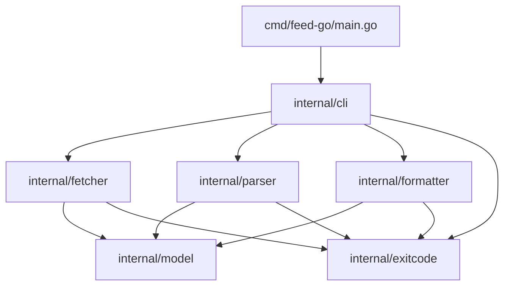
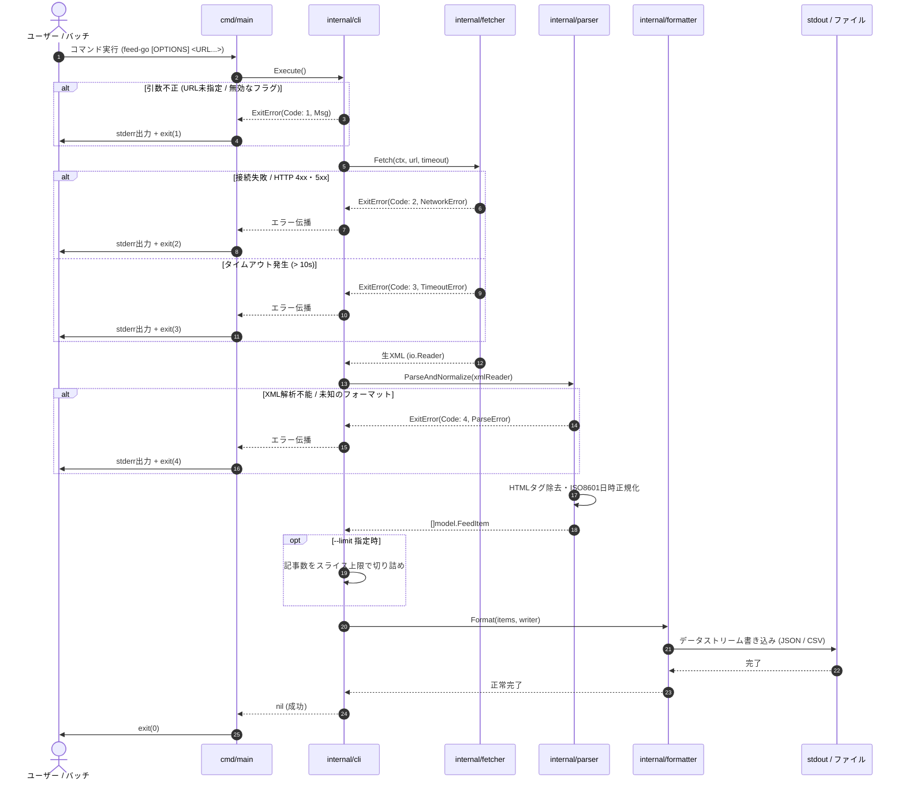
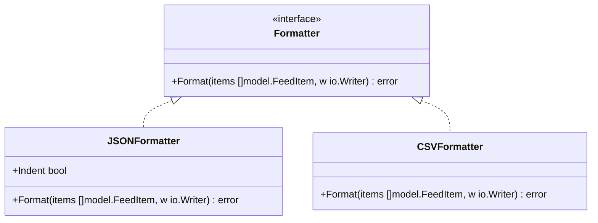

# コマンドラインフィード取得ツール（feed-go）システム設計書

## 1. システム概要・アーキテクチャ全体像

`feed-go` は外部ランタイムに依存しない単一バイナリ形式のCLIツールです。Unix哲学（ストリーム処理・単一責務の原則）に準拠し、標準入力・引数オプションを受け取り、ネットワーク取得、XMLパース、HTMLサニタイズ、データ正規化、フォーマット出力を直列かつ低レイテンシで実行します。

### 1.1 全体アーキテクチャ図

```mermaid
flowchart TD
    subgraph ExecutionContext["実行環境 (OS / Shell / CI/CD)"]
        CLI_INPUT["コマンド引数・フラグ<br/>(URL, -f, -o, -t, -l)"]
        STDOUT["標準出力 (stdout)<br/>正常系データ (JSON / CSV)"]
        STDERR["標準エラー出力 (stderr)<br/>エラー / 警告ログ"]
        FILE_OUT["ファイル出力 (.json / .csv)"]
    end

    subgraph feed_go["feed-go Binary (Go)"]
        CLI["CLI コントローラー<br/>(spf13/cobra)"]
        
        subgraph Pipeline["コア処理パイプライン"]
            FETCHER["HTTP フェッチャー<br/>(net/http + context)"]
            PARSER["フィードパーサー<br/>(mmcdole/gofeed)"]
            SANITIZER["サニタイザー<br/>(HTMLタグ除去・正規化)"]
            FORMATTER["フォーマッター<br/>(JSON / RFC 4180 CSV)"]
        end

        ERR_HANDLER["エラー・終了コード制御<br/>(Exit Code: 0-4)"]
    end

    subgraph External["外部リソース"]
        HTTP_FEED["Webサーバー<br/>(RSS 0.9x/1.0/2.0, Atom)"]
    end

    CLI_INPUT --> CLI
    CLI -->|Context / Config| FETCHER
    FETCHER <-->|HTTP/HTTPS (Timeout: 10s)| HTTP_FEED
    FETCHER -->|Raw XML Stream| PARSER
    PARSER -->|Parsed AST| SANITIZER
    SANITIZER -->|Normalized FeedItem[]| FORMATTER
    
    FORMATTER -->|--output 未指定| STDOUT
    FORMATTER -->|--output 指定時| FILE_OUT
    
    Pipeline -.->|Error| ERR_HANDLER
    CLI -.->|Invalid Flag| ERR_HANDLER
    ERR_HANDLER --> STDERR
    ERR_HANDLER -->|Exit Status| ExecutionContext
```

---

## 2. パッケージ構成（Go標準レイアウト）

Goの標準的なパッケージレイアウト（Standard Go Project Layout）に準拠し、ドメインロジックを `internal` 配下に配置することでカプセル化を担保します。

```text
feed-go/
├── cmd/
│   └── feed-go/
│       └── main.go           # エントリーポイント (終了コード処理・シグナル捕捉)
├── internal/
│   ├── cli/                  # CLIオプション解析・コマンド定義 (Cobra)
│   │   └── root.go
│   ├── fetcher/              # HTTP通信・タイムアウト・リダイレクト制御
│   │   ├── client.go
│   │   └── client_test.go
│   ├── parser/               # RSS/Atomの解析およびHTML除去
│   │   ├── parser.go
│   │   └── sanitize.go
│   ├── formatter/            # JSON/CSVのシリアライズおよび出力抽象化
│   │   ├── formatter.go
│   │   ├── json.go
│   │   └── csv.go
│   ├── model/                # 共通データ構造定義
│   │   └── feed.go
│   └── exitcode/             # 終了コード・ドメインエラー定義
│       └── errors.go
├── go.mod
└── go.sum
```

### 2.1 パッケージ依存関係図



---

## 3. データモデル設計

各フィード規格（RSS 0.9x, 1.0, 2.0, Atom）のスキーマ差分を吸収し、以下の統一モデルへとマッピングします。

```go
package model

import "time"

// FeedItem は正規化された単一記事を表す構造体
type FeedItem struct {
	Title       string    `json:"title"`        // 記事タイトル（空文字許容）
	URL         string    `json:"url"`          // 記事パーマリンクURL
	PublishedAt time.Time `json:"published_at"` // 公開日時（出力時はISO 8601 / RFC 3339）
	Summary     string    `json:"summary"`      // HTMLタグ除去後のプレーンテキスト
	Author      string    `json:"author"`       // 著者名（取得不可時は空文字）
	FeedTitle   string    `json:"feed_title"`   // 配信元Webサイトのタイトル
}

// Config はCLI引数・フラグから構築される実行設定
type Config struct {
	URLs    []string
	Format  string        // "json" | "csv"
	Output  string        // 出力先ファイルパス（未指定時は標準出力）
	Timeout time.Duration // リクエスト全体の最大待機時間（デフォルト: 10秒）
	Limit   int           // 取得記事数の上限（0以下は無制限）
}
```

---

## 4. 処理フロー・シーケンス設計



---

## 5. モジュール詳細仕様

### 5.1 CLI / 実行制御レイヤー (`internal/cli`)
- `spf13/cobra` を用いたPOSIX準拠フラグ解析。
- バリデーション仕様:
  - `<URL...>`: 1つ以上のURL指定を検証。
  - `--format`: `json` または `csv` のいずれかであることを検証。
  - `--timeout`: 1以上の正の整数であることを検証。
- OSシグナル（SIGINT, SIGTERM）をハンドリングし、処理中のコンテキストを即座にキャンセルしてソケットを安全に破棄。

### 5.2 ネットワーク制御レイヤー (`internal/fetcher`)
- **HTTPクライアント設定**:
  - `net.Dialer.Timeout`: 3秒（名前解決およびTCP接続確立）
  - `http.Transport.ResponseHeaderTimeout`: 7秒（レスポンスヘッダー受信待機）
  - `http.Client.Timeout`: 全体で `--timeout` 秒（デフォルト10秒）
  - `CheckRedirect`: リダイレクト上限を5回とし、6回目または循環参照検出時に即時停止。
- **User-Agent仕様**:
  - `feed-go/<version> (+https://github.com/...)` をリクエストヘッダーに設定。
- **リソース管理**: `io.ReadCloser`（Response Body）を確実にクローズし、接続リークを防止。

### 5.3 フィード解析・サニタイズ (`internal/parser`)
- `mmcdole/gofeed` を利用して各種フォーマットを解析。
- **正規化処理**:
  - 日時パース: RSS 0.9x/1.0/2.0 (`pubDate`)、Atom (`updated`/`published`) をパースし、UTC基準の ISO 8601 形式 (`time.RFC3339`) へ変換。
  - 著者情報取得: `author.name`, `dc:creator` 等のフォールバック取得。
- **サニタイズ処理**:
  - `summary` や `content` に含まれるHTML要素（`<p>`, `<a>`, `<script>` 等）を字句解析レベルで完全に除去し、プレーンテキストに変換。
  - 連続する不要な空白文字や空行をトリミング。

### 5.4 出力フォーマッター (`internal/formatter`)
出力先を `io.Writer` インターフェースとして抽象化し、標準出力（`os.Stdout`）とファイル出力（`os.File`）を共通ロジックで処理します。



- **JSONFormatter**:
  - `encoding/json` を使用し、2スペースのインデントを適用したJSON配列としてシリアライズ。
- **CSVFormatter**:
  - `encoding/csv` を使用し、RFC 4180に完全準拠。
  - ヘッダー: `title,url,published_at,summary,author,feed_title`
  - 改行コード: CRLF (`\r\n`)
  - フィールド内にカンマ、改行、ダブルクォーテーションが含まれる場合は適切にエスケープ処理を実施。

---

## 6. エラーハンドリング・終了コードマッピング

プロセス終了コードおよび標準エラー出力（stderr）への出力ルールを厳格に定義します。

| 終了コード | エラー分類 | 発生条件 | stderr 出力フォーマット |
| :---: | :--- | :--- | :--- |
| `0` | 正常終了 | すべてのフィード取得・出力が成功 | （出力なし） |
| `1` | 引数・オプション不正 | URL未指定、無効なフラグ値、オプション構文エラー | `Error: invalid argument: <詳細>` |
| `2` | ネットワークエラー | DNS解決失敗、ホスト未達、HTTP 4xx/5xx、リダイレクト上限超過 | `Error: network failure: <詳細>` |
| `3` | タイムアウト | 接続または読み込みが指定時間を超過 | `Error: request timed out: <詳細>` |
| `4` | パースエラー | 不正なXML、パース不能な未知フォーマット、空レスポンス | `Error: failed to parse feed: <詳細>` |

---

## 7. 非機能要件の実装方針

- **メモリ効率 (30MB以下)**:
  - 複数URLを処理する場合、全フィードの生データをメモリ上に溜め込まず、URLごとに逐次ストリーム処理（Fetch -> Parse -> Format）を実施。
- **高速起動 (50ms以下)**:
  - リフレクションを多用するDIコンテナ等の過度な抽象化を避け、静的な関数呼び出しと明示的な構造体注入を行うことでコールドスタートを最小化。
- **クロスコンパイル・ポータビリティ**:
  - `CGO_ENABLED=0` による完全静的リンクバイナリをビルド。
  - 対象プラットフォーム: `linux/amd64`, `linux/arm64`, `darwin/amd64`, `darwin/arm64`, `windows/amd64`。
