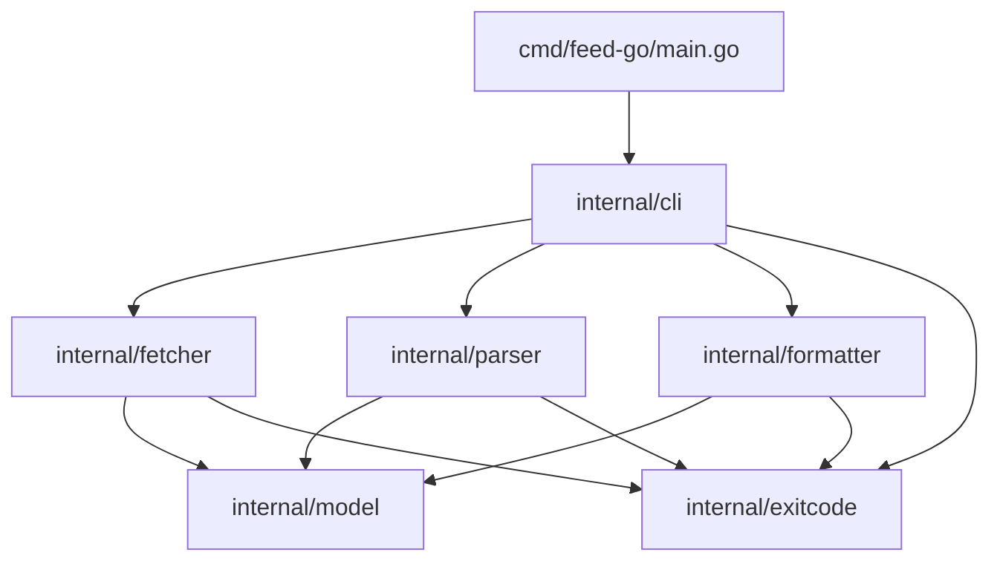
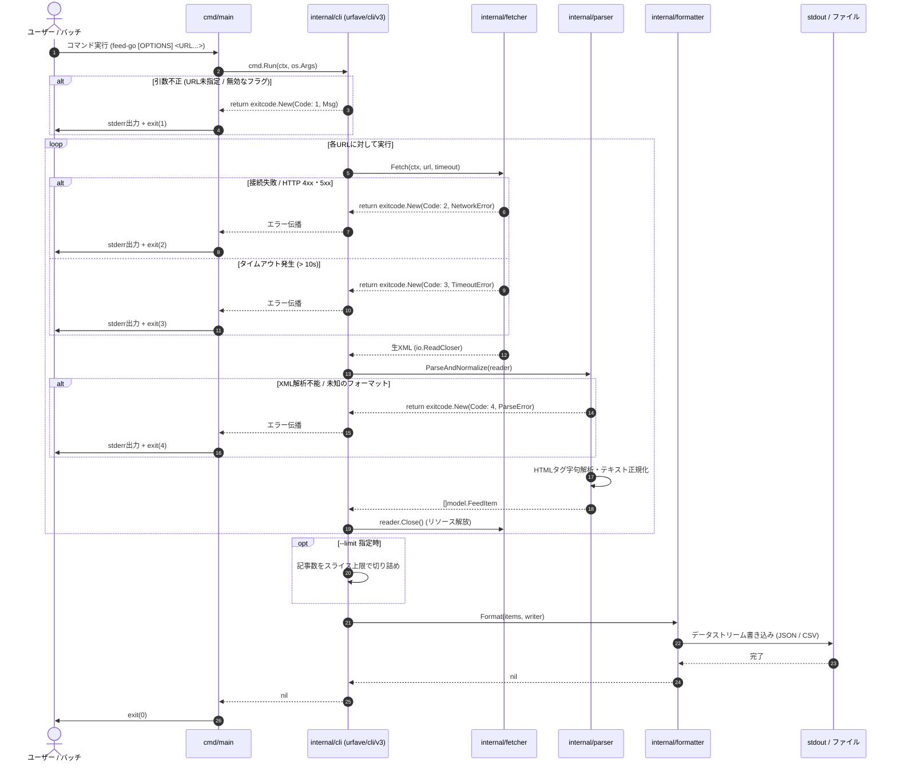
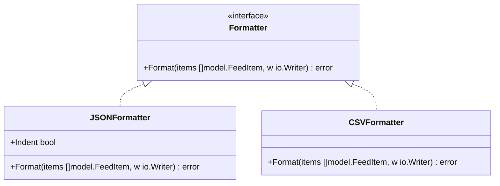
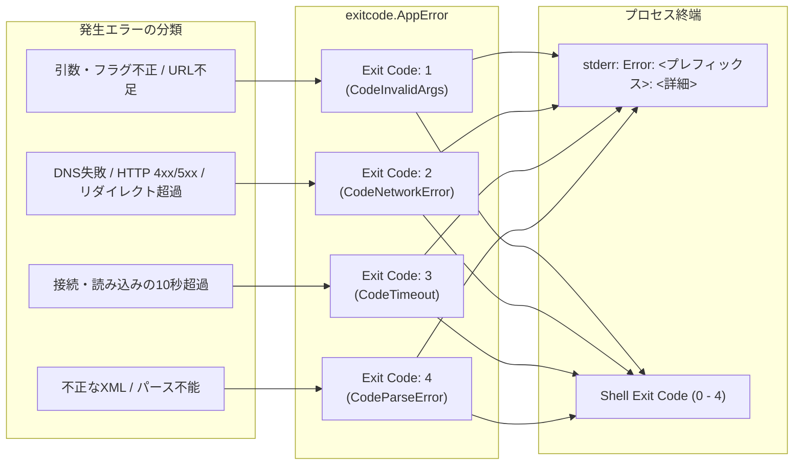

# コマンドラインフィード取得ツール（feed-go）システム設計書

## 1. システム概要・アーキテクチャ全体像

`feed-go` は外部ランタイムに依存しない単一バイナリ形式のCLIツールです[cite: 1, 6]。Unix哲学（ストリーム処理・単一責務の原則）に準拠し、標準入力・引数オプションを受け取り、ネットワーク取得、XMLパース、HTMLサニタイズ、データ正規化、フォーマット出力を直列かつ低レイテンシで実行します[cite: 6]。

### 1.1 全体アーキテクチャ図

```mermaid
flowchart TD
    subgraph ExecutionContext["実行環境 (OS / Shell / CI/CD)"]
        CLI_INPUT["コマンド引数・フラグ<br/>(URL, -f, -o, -t, -l)"]
        STDOUT["標準出力 (stdout)<br/>正常系データ (JSON / CSV)"]
        STDERR["標準エラー出力 (stderr)<br/>エラー / 警告ログ"]
        FILE_OUT["ファイル出力 (.json / .csv)"]
    end

    subgraph feed_go["feed-go Binary (Go)"]
        CLI["CLI コントローラー<br/>(urfave/cli/v3)"]
        
        subgraph Pipeline["コア処理パイプライン"]
            FETCHER["HTTP フェッチャー<br/>(net/http + context)"]
            PARSER["フィードパーサー<br/>(mmcdole/gofeed v1.3.0)"]
            SANITIZER["HTML サニタイザー<br/>(golang.org/x/net/html)"]
            FORMATTER["フォーマッター<br/>(encoding/json, encoding/csv)"]
        end

        ERR_HANDLER["エラー・終了コード制御<br/>(cli.ExitCoder: 0-4)"]
    end

    subgraph External["外部リソース"]
        HTTP_FEED["Webサーバー<br/>(RSS 0.9x/1.0/2.0, Atom)"]
    end

    CLI_INPUT --> CLI
    CLI -->|ctx / Config| FETCHER
    FETCHER <-->|HTTP/HTTPS (Timeout: 10s)| HTTP_FEED
    FETCHER -->|Raw XML Stream (io.Reader)| PARSER
    PARSER -->|Raw Summary/Content| SANITIZER
    SANITIZER -->|Normalized Text| PARSER
    PARSER -->|[]model.FeedItem| FORMATTER
    
    FORMATTER -->|--output 未指定| STDOUT
    FORMATTER -->|--output 指定時| FILE_OUT
    
    Pipeline -.->|Error| ERR_HANDLER
    CLI -.->|Invalid Flag / Args| ERR_HANDLER
    ERR_HANDLER --> STDERR
    ERR_HANDLER -->|Exit Status| ExecutionContext
```

---

## 2. パッケージ構成（Go標準レイアウト）

Goの標準的なパッケージレイアウト（Standard Go Project Layout）に準拠し、ドメインロジックを `internal` 配下に配置することでカプセル化を担保します[cite: 6]。

```text
feed-go/
├── cmd/
│   └── feed-go/
│       └── main.go           # エントリーポイント (urfave/cli/v3 Command 実行と終了コード返却)
├── internal/
│   ├── cli/                  # CLIオプション定義・アクション構築 (urfave/cli/v3)
│   │   ├── app.go
│   │   └── flags.go
│   ├── fetcher/              # HTTP通信・タイムアウト・リダイレクト制御
│   │   ├── client.go
│   │   └── client_test.go
│   ├── parser/               # RSS/Atomの解析およびHTMLサニタイズ
│   │   ├── parser.go         # gofeed連携・モデル正規化
│   │   ├── parser_test.go
│   │   ├── sanitize.go       # x/net/html トークナイザーによるタグ除去
│   │   └── sanitize_test.go
│   ├── formatter/            # JSON/CSVのシリアライズおよび出力抽象化
│   │   ├── formatter.go      # Formatter インターフェース
│   │   ├── json.go
│   │   └── csv.go            # RFC 4180 準拠
│   ├── model/                # 共通データ構造定義
│   │   └── feed.go
│   └── exitcode/             # 終了コード・ドメインエラー定義
│       └── errors.go
├── go.mod
└── go.sum
```

### 2.1 パッケージ依存関係図



---

## 3. データモデル設計

各フィード規格（RSS 0.9x, 1.0, 2.0, Atom）のスキーマ差分を吸収し、以下の統一モデルへとマッピングします[cite: 1, 2, 6]。

```go
package model

import "time"

// FeedItem は正規化された単一記事を表す構造体
type FeedItem struct {
	Title       string    `json:"title"`        // 記事タイトル（前後空白トリミング済み、空文字許容）
	URL         string    `json:"url"`          // 記事パーマリンクURL
	PublishedAt time.Time `json:"published_at"` // 公開日時（UTC基準、ISO 8601 / RFC 3339形式）
	Summary     string    `json:"summary"`      // HTML完全除去・空白改行正規化後のプレーンテキスト
	Author      string    `json:"author"`       // 著者名（取得不可時は空文字列）
	FeedTitle   string    `json:"feed_title"`   // 配信元Webサイトのタイトル
}

// Config はCLI引数・フラグから構築される実行設定
type Config struct {
	URLs    []string
	Format  string        // "json" | "csv"
	Output  string        // 出力先ファイルパス（未指定時は標準出力）
	Timeout time.Duration // 1サイトあたりの最大待機時間（デフォルト: 10秒）
	Limit   int           // 取得記事数の上限（0以下は無制限）
}
```

---

## 4. 処理フロー・シーケンス設計

`urfave/cli/v3` から渡される標準の `context.Context` を最下層の HTTP クライアントまで伝播させ、10秒タイムアウトやOS割り込みシグナルによる中断を即時かつ安全に実行します[cite: 1, 2, 3]。



---

## 5. モジュール詳細仕様

### 5.1 CLI / 実行制御レイヤー (`internal/cli`)
ADR-002 および ADR-003 に従い、**`github.com/urfave/cli/v3`** を採用します[cite: 2, 3, 5]。

- **設計上の特徴**:
  - `*cli.Command` 構造体を用いた宣言的なフラグ・アクション定義[cite: 2, 3]。
  - `Action` 関数のシグネチャ `func(ctx context.Context, cmd *cli.Command) error` により、標準 `context.Context` を第一引数として受け取り、ネットワーク層へ引き渡す[cite: 3]。
- **フラグ仕様**:
  - `--format, -f`: `json` または `csv`（デフォルト: `json`）[cite: 1, 2, 6]。
  - `--output, -o`: 出力ファイルパス（未指定時は `os.Stdout`）[cite: 2, 6]。
  - `--timeout, -t`: タイムアウト秒数（デフォルト: `10`）[cite: 2, 6]。
  - `--limit, -l`: 取得記事数の上限指定（正の整数）[cite: 2, 6]。
- **バリデーション**:
  - 引数に URL が 1 つ以上存在すること[cite: 2, 6]。
  - `--format` が許可された値であること[cite: 6]。

```go
// internal/cli/app.go の設計イメージ (urfave/cli/v3)
package cli

import (
	"context"
	"feed-go/internal/exitcode"
	"[github.com/urfave/cli/v3](https://github.com/urfave/cli/v3)"
)

func NewCommand() *cli.Command {
	return &cli.Command{
		Name:      "feed-go",
		Usage:     "Fetch and parse web feeds (RSS/Atom) into JSON or CSV",
		ArgsUsage: "<URL...>",
		Flags: []cli.Flag{
			&cli.StringFlag{
				Name:    "format",
				Aliases: []string{"f"},
				Value:   "json",
				Usage:   "Output format: json or csv",
			},
			&cli.StringFlag{
				Name:    "output",
				Aliases: []string{"o"},
				Usage:   "Output file path (default: stdout)",
			},
			&cli.IntFlag{
				Name:    "timeout",
				Aliases: []string{"t"},
				Value:   10,
				Usage:   "Max execution timeout in seconds",
			},
			&cli.IntFlag{
				Name:    "limit",
				Aliases: []string{"l"},
				Usage:   "Limit number of items to output",
			},
		},
		Action: func(ctx context.Context, cmd *cli.Command) error {
			if cmd.Args().Len() == 0 {
				return exitcode.New(exitcode.CodeInvalidArgs, "URL must be specified")
			}
			return runPipeline(ctx, cmd)
		},
	}
}
```

### 5.2 ネットワーク制御レイヤー (`internal/fetcher`)
ADR-001 に従い、Go 標準パッケージ `net/http` と `context.WithTimeout` を組み合わせて構成します[cite: 1, 2]。

- **タイムアウト内訳**:
  - 接続確立（Connect）: `net.Dialer.Timeout = 3 * time.Second`[cite: 1, 2, 6]
  - レスポンスヘッダー待機: `http.Transport.ResponseHeaderTimeout = 7 * time.Second`[cite: 6]
  - リクエスト全体の最大待機: `--timeout` 秒（デフォルト 10 秒）[cite: 1, 6]
- **リダイレクト制御**:
  - `CheckRedirect` により、HTTP 3xx リダイレクトを最大 5 回まで追跡[cite: 1, 2, 6]。6 回目または循環参照の検知時に即時エラーを返却[cite: 1, 6]。
- **User-Agent 仕様**:
  - `feed-go/<version> (+https://github.com/...)` をリクエストヘッダーへ設定[cite: 1, 2, 6]。
- **リソース管理**:
  - 呼び出し元が責任を持って `resp.Body.Close()` を呼び出せるよう、`io.ReadCloser` を返却するインターフェースとする。

```go
// internal/fetcher/client.go の設計イメージ
package fetcher

import (
	"context"
	"errors"
	"fmt"
	"io"
	"net"
	"net/http"
	"time"
)

type Fetcher struct {
	client *http.Client
}

func NewFetcher(timeout time.Duration) *Fetcher {
	return &Fetcher{
		client: &http.Client{
			Timeout: timeout,
			Transport: &http.Transport{
				DialContext: (&net.Dialer{
					Timeout: 3 * time.Second,
				}).DialContext,
				ResponseHeaderTimeout: 7 * time.Second,
			},
			CheckRedirect: func(req *http.Request, via []*http.Request) error {
				if len(via) >= 5 {
					return errors.New("stopped after 5 redirects")
				}
				return nil
			},
		},
	}
}

func (f *Fetcher) Fetch(ctx context.Context, targetURL string) (io.ReadCloser, error) {
	req, err := http.NewRequestWithContext(ctx, http.MethodGet, targetURL, nil)
	if err != nil {
		return nil, err
	}
	req.Header.Set("User-Agent", "feed-go/1.0.0 (+[https://github.com/example/feed-go](https://github.com/example/feed-go))")

	resp, err := f.client.Do(req)
	if err != nil {
		return nil, err
	}

	if resp.StatusCode < 200 || resp.StatusCode >= 300 {
		resp.Body.Close()
		return nil, fmt.Errorf("GET %s failed with status %d", targetURL, resp.StatusCode)
	}

	return resp.Body, nil
}
```

### 5.3 フィード解析・サニタイズレイヤー (`internal/parser`)
ADR-004 に従い、パーサーに **`github.com/mmcdole/gofeed` (v1.3.0系)**、サニタイザーに **`golang.org/x/net/html`** を採用します[cite: 4, 5]。

- **パース連携**:
  - フェッチャーが取得した生 XML ストリーム（`io.Reader`）を直接 `gofeed.NewParser().Parse(r)` に渡し、通信とパースの責務を分離[cite: 1, 4]。
- **日時の正規化**:
  - `item.PublishedParsed` を優先取得し、存在しない場合は `item.UpdatedParsed` を採用[cite: 1, 4, 5]。
  - UTC タイムゾーンに変換した上で ISO 8601（RFC 3339）として統一[cite: 1, 4, 5]。
- **サニタイズ処理仕様（`internal/parser/sanitize.go`）**:
  1. `item.Description` を優先採用し、空文字列の場合は `item.Content` をフォールバックとして採用[cite: 1, 4, 5]。
  2. `golang.org/x/net/html` のトークナイザーを用い、`<script>` および `<style>` タグはタグ内部の文字列も含めて完全に破棄[cite: 1, 4, 5]。
  3. ブロック要素（`<p>`, `<div>`, `<h1>`〜`<h6>`, `<li>`, `<br>`, `<article>`, `<section>` 等）の境界に改行文字を挿入[cite: 4, 5]。
  4. 連続する半角・全角スペースおよびタブ文字を単一の半角スペースに集約[cite: 1, 4, 5]。
  5. 3つ以上連続する空行を `\n\n`（最大2つの改行）に圧縮し、前後の不要な空白をトリミング[cite: 4, 5]。

### 5.4 出力フォーマッターレイヤー (`internal/formatter`)
出力先を `io.Writer` として抽象化し、標準出力（`os.Stdout`）とファイル（`os.File`）を同一ロジックで処理します[cite: 6]。



- **JSONFormatter**:
  - `encoding/json` を使用[cite: 1, 2, 5, 6]。
  - 2スペースのインデントを適用した可読性の高い配列形式で出力[cite: 1, 5, 6]。
- **CSVFormatter**:
  - `encoding/csv` を使用し、**RFC 4180** に完全準拠[cite: 1, 2, 5, 6]。
  - ヘッダー行: `title,url,published_at,summary,author,feed_title`[cite: 1, 2, 5, 6]
  - 改行コード: CRLF（`\r\n`）[cite: 1, 5, 6]
  - フィールド内のカンマ、ダブルクォーテーション、改行文字をエスケープ（`"` は `""` に置換）[cite: 1, 2, 5, 6]。

---

## 6. エラーハンドリング・終了コードマッピング

ADR-001 および ADR-002 に準拠し、ドメインエラーを明確な終了コード（1〜4）として管理します[cite: 1, 2]。`urfave/cli/v3` の `cli.ExitCoder` インターフェースを実装することで、フレームワークを通じて安全にOSプロセス終了コードへ反映します[cite: 2]。



| 終了コード | 定数名 | 発生条件 | stderr 出力プレフィックス |
| :---: | :--- | :--- | :--- |
| `0` | - | 全フィードの取得・出力が正常完了 | （出力なし） |
| `1` | `CodeInvalidArgs` | URL未指定、無効なフラグ値、構文エラー | `Error: invalid argument: ` |
| `2` | `CodeNetworkError` | DNS解決失敗、ホスト未達、HTTP 4xx/5xx、リダイレクト上限超過 | `Error: network failure: ` |
| `3` | `CodeTimeout` | 接続または読み込みが指定時間を超過（`context.DeadlineExceeded`） | `Error: request timed out: ` |
| `4` | `CodeParseError` | 不正なXML構造、未知のフィード形式、空レスポンス | `Error: failed to parse feed: ` |

```go
// internal/exitcode/errors.go の設計イメージ
package exitcode

import "fmt"

const (
	CodeInvalidArgs  = 1
	CodeNetworkError = 2
	CodeTimeout      = 3
	CodeParseError   = 4
)

type AppError struct {
	Code    int
	Message string
	Err     error
}

func (e *AppError) Error() string {
	if e.Err != nil {
		return fmt.Sprintf("%s: %v", e.Message, e.Err)
	}
	return e.Message
}

// ExitCode は urfave/cli の ExitCoder インターフェースを満たす
func (e *AppError) ExitCode() int {
	return e.Code
}

func New(code int, msg string) error {
	return &AppError{Code: code, Message: msg}
}

func Wrap(code int, msg string, err error) error {
	return &AppError{Code: code, Message: msg, Err: err}
}
```

---

## 7. 非機能要件・ビルド運用設計

- **メモリ効率（30MB以下）**:
  - 複数URLが指定された場合も、全XMLレスポンスをメモリ上に同時に保持せず、1URLごとに「取得 -> パース -> 正規化」をストリーム処理で逐次実行します[cite: 1, 4, 6]。
- **起動時間オーバーヘッド（50ms以下）**:
  - リフレクションや初期化コストの重いDIフレームワークを排除し、静的な構造体初期化と関数呼び出しでパイプラインを組み立てます[cite: 1, 6]。
- **クロスコンパイル・ポータビリティ**:
  - `CGO_ENABLED=0` による完全静的リンクバイナリを生成[cite: 1, 5, 6]。
  - 対応OS/アーキテクチャ: `linux/amd64`, `linux/arm64`, `darwin/amd64`, `darwin/arm64`, `windows/amd64`[cite: 1, 5, 6]。

---

## 8. 技術選定・開発標準まとめ（ADR対応表）

| コンポーネント | 採用技術 / ライブラリ | バージョン / 仕様 | 準拠ADR |
| :--- | :--- | :--- | :--- |
| **開発言語** | Go | 最新安定版 | ADR-001[cite: 5] |
| **CLIフレームワーク** | `github.com/urfave/cli/v3` | v3系（Contextファースト） | ADR-002, ADR-003[cite: 5] |
| **フィードパーサー** | `github.com/mmcdole/gofeed` | v1.3.0系（最新安定版） | ADR-004[cite: 5] |
| **HTMLサニタイザー** | `golang.org/x/net/html` | 最新安定版（トークナイザー利用） | ADR-004[cite: 5] |
| **通信 / シリアライズ** | `net/http`, `encoding/json`, `encoding/csv` | Go 標準パッケージ（RFC 4180準拠） | ADR-001[cite: 1, 5] |
